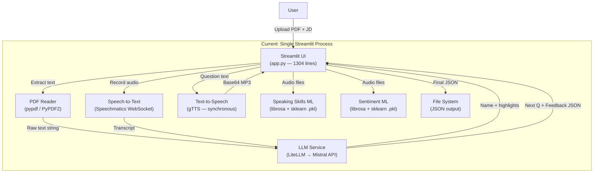
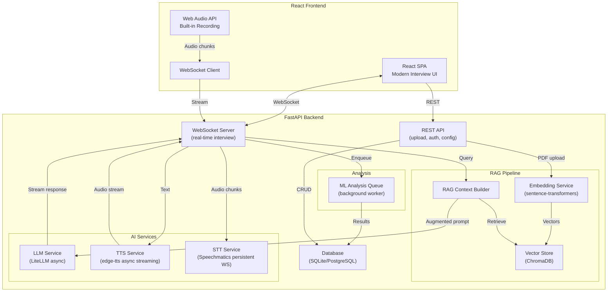
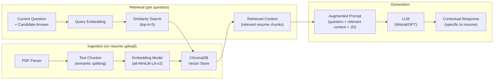

# AI Interview System — Architecture Analysis & Migration Plan

## Table of Contents
1. [Current Architecture](#1-current-architecture)
2. [Root Causes of Slowness](#2-root-causes-of-slowness)
3. [New Optimized Architecture with RAG](#3-new-optimized-architecture-with-rag)
4. [New Tech Stack & UI Design](#4-new-tech-stack--ui-design)
5. [Implementation Roadmap](#5-implementation-roadmap)

---

## 1. Current Architecture

### 1.1 System Overview

The project is a monolithic **Streamlit** application that conducts AI-powered mock interviews. Everything — UI, business logic, LLM calls, audio processing, and ML inference — runs in a single Python process.



### 1.2 File-by-File Breakdown

| File | Role | Lines |
|---|---|---|
| [app.py](file:///d:/Desktop/new_ai_interview/AI-INTERVIEW-SYSTEM/app.py) | Streamlit frontend — entire UI, session state, interview loop | 1304 |
| [main.py](file:///d:/Desktop/new_ai_interview/AI-INTERVIEW-SYSTEM/main.py) | CLI entrypoint (alternative to Streamlit) | 196 |
| [llm_call.py](file:///d:/Desktop/new_ai_interview/AI-INTERVIEW-SYSTEM/utils/llm_call.py) | LiteLLM wrapper — synchronous `completion()` + JSON parsing | 74 |
| [prompts.py](file:///d:/Desktop/new_ai_interview/AI-INTERVIEW-SYSTEM/utils/prompts.py) | 3 prompt templates: `basic_details`, `next_question_generation`, `feedback_generation` | 165 |
| [analyze_candidate.py](file:///d:/Desktop/new_ai_interview/AI-INTERVIEW-SYSTEM/utils/analyze_candidate.py) | Async wrapper — concurrent feedback + next-question via `ThreadPoolExecutor` | 242 |
| [transcript_audio.py](file:///d:/Desktop/new_ai_interview/AI-INTERVIEW-SYSTEM/utils/transcript_audio.py) | Speechmatics WebSocket STT client | 80 |
| [text_to_speech.py](file:///d:/Desktop/new_ai_interview/AI-INTERVIEW-SYSTEM/utils/text_to_speech.py) | gTTS synchronous TTS → saves temp MP3 → returns base64 | 58 |
| [basic_details.py](file:///d:/Desktop/new_ai_interview/AI-INTERVIEW-SYSTEM/utils/basic_details.py) | Resume parsing via LLM + greeting/thanks message templates | 51 |
| [load_content.py](file:///d:/Desktop/new_ai_interview/AI-INTERVIEW-SYSTEM/utils/load_content.py) | PDF text extraction (pypdf + PyPDF2) | 30 |
| [evaluation.py](file:///d:/Desktop/new_ai_interview/AI-INTERVIEW-SYSTEM/utils/evaluation.py) | Simple score averaging | 9 |
| [record_utils.py](file:///d:/Desktop/new_ai_interview/AI-INTERVIEW-SYSTEM/utils/record_utils.py) | `sounddevice` recording + `noisereduce` | 94 |
| [save_interview_data.py](file:///d:/Desktop/new_ai_interview/AI-INTERVIEW-SYSTEM/utils/save_interview_data.py) | JSON file output to `outputs/` | 17 |
| [speaking_skills_analyzer.py](file:///d:/Desktop/new_ai_interview/AI-INTERVIEW-SYSTEM/utils/speaking_skills_analyzer.py) | ML model (RandomForest) — speech rate, clarity, fluency, etc. via librosa | 555 |
| [sentiment_audio_analyzer.py](file:///d:/Desktop/new_ai_interview/AI-INTERVIEW-SYSTEM/utils/sentiment_audio_analyzer.py) | ML model (RandomForest) — emotion, confidence, stress via librosa | 813 |

### 1.3 Current Data Flow (Step-by-Step)

```
1. User uploads PDF resume + pastes Job Description in Streamlit sidebar
2. pypdf extracts raw text from PDF
3. RAW text is stuffed into the `basic_details` prompt → sent to Mistral LLM
4. LLM returns JSON: { name, resume_highlights }
5. User clicks "Start Interview"
6. Random greeting message is generated + spoken via gTTS (synchronous HTTP call)
7. Audio is base64-encoded and auto-played via hidden <audio> tag
8. User records answer via st.audio_input → saved as .wav file
9. .wav file is sent to Speechmatics WebSocket API → returns transcript text
10. Transcript + previous Q + resume_highlights + JD → stuffed into prompt
11. TWO concurrent LLM calls via ThreadPoolExecutor:
    - next_question_generation prompt → returns next question
    - feedback_generation prompt → returns score + feedback JSON
12. Next question is spoken via gTTS, cycle repeats (steps 7-11)
13. After max_questions reached → thanks message + final score calculation
14. Speaking Skills Analyzer runs librosa feature extraction on audio files
15. Sentiment Analyzer runs librosa feature extraction on audio files
16. All results saved as JSON to outputs/ directory
```

### 1.4 Current Tech Stack

| Layer | Technology |
|---|---|
| Frontend | Streamlit 1.45 |
| LLM | LiteLLM → Mistral (`mistral-small-latest`) |
| Speech-to-Text | Speechmatics (WebSocket API) |
| Text-to-Speech | gTTS (Google Translate TTS) |
| PDF Parsing | pypdf + PyPDF2 |
| Audio Processing | librosa, sounddevice, noisereduce, scipy |
| ML Models | scikit-learn RandomForest (2 [.pkl](file:///d:/Desktop/new_ai_interview/AI-INTERVIEW-SYSTEM/models/sentiment_model.pkl) files) |
| Data Storage | Local JSON files |
| Audio Recording | `st.audio_input` (Streamlit widget) / `sounddevice` (CLI) |

---

## 2. Root Causes of Slowness

> [!CAUTION]
> The current system has **6 major performance bottlenecks** that compound to create 15-30 second delays between each Q&A turn.

### 2.1 Bottleneck Analysis

| # | Bottleneck | Impact | Where |
|---|---|---|---|
| **B1** | **Synchronous gTTS** — makes HTTP call to Google Translate, saves temp file, reads back, base64-encodes | ~2-4s per question | [text_to_speech.py](file:///d:/Desktop/new_ai_interview/AI-INTERVIEW-SYSTEM/utils/text_to_speech.py) |
| **B2** | **Sequential LLM calls** — even with `ThreadPoolExecutor`, Streamlit's rerun model forces full page reload after each state change | ~3-8s per call (×2 concurrent) | [analyze_candidate.py](file:///d:/Desktop/new_ai_interview/AI-INTERVIEW-SYSTEM/utils/analyze_candidate.py) |
| **B3** | **Streamlit rerun architecture** — `st.rerun()` re-executes the ENTIRE [main()](file:///d:/Desktop/new_ai_interview/AI-INTERVIEW-SYSTEM/app.py#1245-1300) function from scratch on every interaction | Cumulative overhead grows per question | [app.py](file:///d:/Desktop/new_ai_interview/AI-INTERVIEW-SYSTEM/app.py) (lines 386, 353) |
| **B4** | **No resume caching** — raw resume text is injected into every LLM prompt (repeated in every call, wastes tokens) | Token waste + slower inference | [prompts.py](file:///d:/Desktop/new_ai_interview/AI-INTERVIEW-SYSTEM/utils/prompts.py) |
| **B5** | **Speechmatics WebSocket per-call** — creates a new WebSocket connection for each transcription instead of keeping persistent connection | ~1-2s connection overhead | [transcript_audio.py](file:///d:/Desktop/new_ai_interview/AI-INTERVIEW-SYSTEM/utils/transcript_audio.py) |
| **B6** | **Post-interview ML analysis** — librosa feature extraction on ALL audio files runs sequentially at the end | ~5-15s blocking | [app.py](file:///d:/Desktop/new_ai_interview/AI-INTERVIEW-SYSTEM/app.py) (lines 920-1225) |

### 2.2 Architectural Anti-Patterns

- **No separation of concerns** — 1304-line monolith mixes UI, state, API calls, and ML
- **No WebSocket/streaming** — every interaction is request-response with full page reload
- **No vector store / RAG** — raw text pasted into prompts wastes context window and produces generic responses
- **No async I/O** — gTTS and Speechmatics calls block the event loop
- **Session state abuse** — 20+ session state variables with complex interdependencies

---

## 3. New Optimized Architecture with RAG

### 3.1 High-Level Architecture



### 3.2 RAG Pipeline Design

The RAG pipeline is the **most critical improvement** — it replaces dumping raw resume text into every prompt with intelligent, contextual retrieval.



**How RAG improves the system:**

| Aspect | Before (Current) | After (RAG) |
|---|---|---|
| Resume context | Entire raw text dumped into every prompt (~2000+ tokens) | Only relevant chunks retrieved (~200-400 tokens) |
| Question relevance | Generic questions based on full resume dump | Specific questions about relevant skills/experiences |
| Token usage | ~3000-4000 tokens per call | ~1000-1500 tokens per call |
| LLM response time | Slower (larger prompt) | **2-3× faster** (smaller, focused prompt) |
| Feedback quality | Surface-level (LLM skims long context) | **Deep and specific** (focused on relevant details) |

### 3.3 WebSocket Real-Time Flow

Instead of Streamlit's page-reload model, the new system uses **persistent WebSocket connections** for real-time bidirectional communication:

```
Client                          Server
  |                                |
  |--- WS Connect --------------->|
  |                                |
  |--- START_INTERVIEW ---------->|  (resume_id, job_desc)
  |<-- GREETING (streaming) ------|  (text chunks + audio chunks)
  |                                |
  |--- AUDIO_CHUNK (streaming) -->|  (real-time mic data)
  |<-- TRANSCRIPT_PARTIAL --------|  (partial transcription)
  |--- AUDIO_END ---------------->|
  |<-- TRANSCRIPT_FINAL ----------|
  |                                |
  |<-- THINKING ------------------|  (typing indicator)
  |<-- NEXT_QUESTION (streaming) -|  (text + audio streamed together)
  |<-- FEEDBACK ------------------|  (score + feedback JSON)
  |                                |
  |   ... repeat for each Q&A ... |
  |                                |
  |<-- INTERVIEW_COMPLETE --------|  (final scores + analysis)
  |--- WS Disconnect ------------->|
```

**Speed improvement**: This eliminates the ~2-5s overhead per interaction from Streamlit's full-page rerun.

---

## 4. New Tech Stack & UI Design

### 4.1 Complete Tech Stack Migration

| Layer | Current | New | Why |
|---|---|---|---|
| **Frontend** | Streamlit | **React 18 + Vite** | Component-based, real-time, rich UI |
| **Backend** | Streamlit server | **FastAPI** | Async-native, WebSocket support, OpenAPI docs |
| **Real-time** | Page reload (`st.rerun`) | **WebSocket** | Bidirectional streaming, zero reload |
| **LLM** | LiteLLM (sync) | **LiteLLM (async)** | Non-blocking, streaming responses |
| **TTS** | gTTS (sync HTTP) | **edge-tts (async streaming)** | 3× faster, better voices, streaming |
| **STT** | Speechmatics (new WS per call) | **Speechmatics (persistent WS)** | Connection reuse, real-time partials |
| **RAG** | ❌ None | **ChromaDB + sentence-transformers** | Contextual retrieval, faster inference |
| **PDF Parsing** | pypdf + PyPDF2 | **pypdf + LangChain text splitter** | Semantic chunking for RAG |
| **Audio Recording** | `st.audio_input` | **Web Audio API (MediaRecorder)** | Native browser, streaming to server |
| **ML Analysis** | Synchronous (blocking) | **Background task queue** | Non-blocking, parallel processing |
| **Database** | Local JSON files | **SQLite (dev) / PostgreSQL (prod)** | Proper persistence, queries, history |
| **Styling** | Streamlit CSS hacks | **Vanilla CSS + CSS Variables** | Full control, premium design |

### 4.2 New UI Design — Interview-Oriented

The new UI is designed to feel like a **professional video interview platform** (similar to HireVue/Pramp), not a chatbot.

#### Page 1: Landing / Setup
```
┌──────────────────────────────────────────────────────────┐
│  🎯 AI Interview Pro                        [Dark Mode] │
├──────────────────────────────────────────────────────────┤
│                                                          │
│   ┌─────────────────────┐  ┌──────────────────────────┐ │
│   │                     │  │  📄 Upload Your Resume   │ │
│   │   Hero Animation    │  │  ┌────────────────────┐  │ │
│   │   (Lottie/CSS)      │  │  │  Drop PDF here     │  │ │
│   │                     │  │  └────────────────────┘  │ │
│   └─────────────────────┘  │                          │ │
│                            │  📋 Job Description      │ │
│                            │  ┌────────────────────┐  │ │
│                            │  │  Paste JD here...  │  │ │
│                            │  └────────────────────┘  │ │
│                            │                          │ │
│                            │  ⚙️ Settings             │ │
│                            │  Questions: [5 ▾]        │ │
│                            │  Voice: [Alex ▾]         │ │
│                            │                          │ │
│                            │  [🚀 Start Interview]    │ │
│                            └──────────────────────────┘ │
└──────────────────────────────────────────────────────────┘
```

#### Page 2: Live Interview
```
┌──────────────────────────────────────────────────────────┐
│  Question 2 of 5          ████████░░ 40%       00:12:34 │
├──────────────────────────────────────────────────────────┤
│                                                          │
│  ┌──────────────────────────────────────────────────┐   │
│  │  🤖 AI Interviewer (Alex)                        │   │
│  │                                                    │   │
│  │  "Tell me about a time when you had to lead a     │   │
│  │   cross-functional team through a challenging      │   │
│  │   project. What was your approach?"                │   │
│  │                                           🔊 ▶️    │   │
│  └──────────────────────────────────────────────────┘   │
│                                                          │
│  ┌──────────────────────────────────────────────────┐   │
│  │  👤 Your Response                                 │   │
│  │                                                    │   │
│  │  Live transcript appears here as you speak...      │   │
│  │  ░░░░░░░░░░░░░░░░░░░░░░░░░░░░░░░░░░░░░░░░░░░░░   │   │
│  │                                                    │   │
│  │         🎙️ [Recording...] ⏱️ 0:45                 │   │
│  └──────────────────────────────────────────────────┘   │
│                                                          │
│  ┌────────┐  ┌──────────┐  ┌────────────────────────┐  │
│  │ ⏸ Pause│  │ 🔴 Stop  │  │ ⏭ Skip Question       │  │
│  └────────┘  └──────────┘  └────────────────────────┘  │
└──────────────────────────────────────────────────────────┘
```

#### Page 3: Results Dashboard
```
┌──────────────────────────────────────────────────────────┐
│  📊 Interview Results                    [Download PDF] │
├──────────────────────────────────────────────────────────┤
│                                                          │
│  ┌─────────┐ ┌─────────┐ ┌─────────┐ ┌──────────────┐ │
│  │ Overall │ │ Commun. │ │ Tech.   │ │ Confidence   │ │
│  │  8.2/10 │ │  7.5/10 │ │  8.8/10 │ │  7.9/10      │ │
│  │   ⭐⭐  │ │   📢    │ │   💻    │ │   💪         │ │
│  └─────────┘ └─────────┘ └─────────┘ └──────────────┘ │
│                                                          │
│  ┌──────────────────────────────────────────────────┐   │
│  │  📈 Radar Chart: Competency Breakdown            │   │
│  │  (Technical, Problem-Solving, Communication,      │   │
│  │   Leadership, Cultural Fit, Growth Mindset)       │   │
│  └──────────────────────────────────────────────────┘   │
│                                                          │
│  ┌──────────────────────────────────────────────────┐   │
│  │  Q1: "Tell me about yourself..." — 7.5/10        │   │
│  │  ✅ Good structure  💡 Add more metrics           │   │
│  ├──────────────────────────────────────────────────┤   │
│  │  Q2: "Describe a leadership..." — 8.8/10         │   │
│  │  ✅ Excellent STAR format  ✅ Strong impact        │   │
│  └──────────────────────────────────────────────────┘   │
│                                                          │
│  [🔄 New Interview]  [📜 View History]                  │
└──────────────────────────────────────────────────────────┘
```

### 4.3 New Project Structure

```
new_ai_interview/
├── backend/                          # FastAPI Backend
│   ├── main.py                       # FastAPI app entry + CORS + lifespan
│   ├── requirements.txt
│   ├── .env
│   ├── api/
│   │   ├── routes/
│   │   │   ├── interview.py          # REST endpoints (upload, start, history)
│   │   │   └── websocket.py          # WebSocket handler for live interview
│   │   └── deps.py                   # Dependency injection
│   ├── core/
│   │   ├── config.py                 # Settings (pydantic-settings)
│   │   └── database.py               # SQLAlchemy / SQLite setup
│   ├── services/
│   │   ├── llm_service.py            # Async LiteLLM wrapper
│   │   ├── rag_service.py            # ChromaDB + embeddings + retrieval
│   │   ├── tts_service.py            # Async edge-tts streaming
│   │   ├── stt_service.py            # Speechmatics persistent WS
│   │   ├── pdf_service.py            # PDF parsing + chunking
│   │   ├── interview_service.py      # Interview state machine
│   │   └── analysis_service.py       # ML analysis (background)
│   ├── models/
│   │   ├── schemas.py                # Pydantic request/response models
│   │   └── db_models.py             # SQLAlchemy ORM models
│   ├── prompts/
│   │   └── templates.py              # All prompt templates
│   └── ml_models/                    # Pre-trained .pkl files
│       ├── sentiment_model.pkl
│       └── speaking_skills_model.pkl
│
├── frontend/                         # React Frontend
│   ├── package.json
│   ├── vite.config.js
│   ├── index.html
│   ├── public/
│   └── src/
│       ├── main.jsx
│       ├── App.jsx
│       ├── index.css                 # Global design system
│       ├── pages/
│       │   ├── Landing.jsx           # Setup page
│       │   ├── Interview.jsx         # Live interview page
│       │   ├── Results.jsx           # Results dashboard
│       │   └── History.jsx           # Past interviews
│       ├── components/
│       │   ├── AudioRecorder.jsx     # Web Audio API recorder
│       │   ├── ChatMessage.jsx       # Message bubble component
│       │   ├── ScoreCard.jsx         # Score display card
│       │   ├── RadarChart.jsx        # Competency radar chart
│       │   ├── ProgressBar.jsx       # Interview progress
│       │   ├── FileUpload.jsx        # Drag-and-drop PDF upload
│       │   └── Timer.jsx             # Interview timer
│       ├── hooks/
│       │   ├── useWebSocket.js       # WebSocket connection hook
│       │   ├── useAudioRecorder.js   # Audio recording hook
│       │   └── useInterview.js       # Interview state management
│       └── utils/
│           └── api.js                # REST API client
│
└── README.md
```

---

## 5. Implementation Roadmap

### Phase 1: FastAPI Backend Foundation
> **Files:** `backend/main.py`, `backend/core/`, `backend/models/`, `backend/api/routes/interview.py`

1. Initialize FastAPI app with CORS, lifespan events
2. Set up SQLite database with SQLAlchemy models (Interview, Question, Result)
3. Create REST endpoints: `POST /upload-resume`, `GET /interviews`, `GET /interviews/{id}`
4. Migrate [llm_call.py](file:///d:/Desktop/new_ai_interview/AI-INTERVIEW-SYSTEM/utils/llm_call.py) → async `services/llm_service.py`
5. Migrate [text_to_speech.py](file:///d:/Desktop/new_ai_interview/AI-INTERVIEW-SYSTEM/utils/text_to_speech.py) → async `services/tts_service.py` (using edge-tts)
6. Migrate [transcript_audio.py](file:///d:/Desktop/new_ai_interview/AI-INTERVIEW-SYSTEM/utils/transcript_audio.py) → persistent WS `services/stt_service.py`

---

### Phase 2: RAG Pipeline
> **Files:** `backend/services/rag_service.py`, `backend/services/pdf_service.py`

1. Implement PDF parsing + semantic text chunking (split by sections, paragraphs)
2. Set up ChromaDB vector store with `all-MiniLM-L6-v2` embeddings
3. Build ingestion pipeline: PDF → chunks → embeddings → ChromaDB
4. Build retrieval function: query → top-k similar chunks → context string
5. Update prompt templates to use RAG-retrieved context instead of raw resume text
6. Add resume chunk metadata (section type: skills, experience, education, etc.)

---

### Phase 3: WebSocket Interview Flow
> **Files:** `backend/api/routes/websocket.py`, `backend/services/interview_service.py`

1. Implement WebSocket endpoint `/ws/interview/{session_id}`
2. Build interview state machine (IDLE → GREETING → Q&A → COMPLETE)
3. Implement message protocol (START, AUDIO_CHUNK, TRANSCRIPT, QUESTION, FEEDBACK, etc.)
4. Wire up streaming LLM responses through WebSocket
5. Wire up streaming TTS audio through WebSocket
6. Implement real-time STT with partial transcripts
7. Background ML analysis via asyncio tasks (non-blocking)

---

### Phase 4: React Frontend
> **Files:** All `frontend/src/` files

1. Scaffold React + Vite project
2. Build design system in `index.css` (dark theme, CSS variables, animations)
3. Build Landing page (PDF upload, JD input, settings)
4. Build Interview page (chat UI, audio recorder, progress bar, timer)
5. Build Results page (score cards, radar chart, Q&A breakdown)
6. Implement `useWebSocket` hook for real-time communication
7. Implement `useAudioRecorder` hook (Web Audio API + MediaRecorder)
8. Build History page for past interviews

---

### Phase 5: Integration & Polish
1. End-to-end testing of complete interview flow
2. Error handling and reconnection logic for WebSocket
3. Loading states, animations, and micro-interactions
4. Mobile-responsive design
5. PDF export of results

---

## Verification Plan

### Automated Tests
- **Backend unit tests**: Run with `cd backend && python -m pytest tests/ -v`
  - Test RAG ingestion and retrieval accuracy
  - Test LLM service async calls
  - Test WebSocket message protocol
  - Test interview state machine transitions
- **Frontend**: Run with `cd frontend && npm test`
  - Component rendering tests

### Manual Verification
1. **Upload flow**: Upload a PDF resume → verify text is chunked and stored in ChromaDB → confirm via `/debug/rag-chunks` endpoint
2. **Interview flow**: Start interview via WebSocket → verify real-time question streaming + audio playback → record answer → verify transcript + feedback appear with <3s latency
3. **RAG quality**: Compare LLM responses with and without RAG to verify specificity improvement
4. **Speed comparison**: Time the full Q&A cycle (should be <5s vs current 15-30s)

> [!IMPORTANT]
> The migration is designed to be **incremental**. Each phase produces a working system. Phase 1-2 can be tested with Postman/curl before the React frontend exists.
